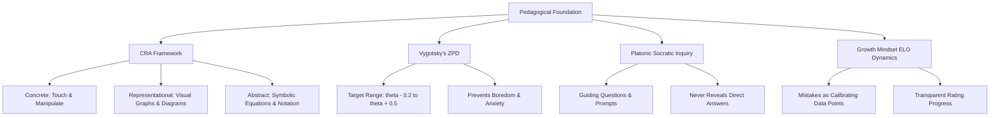
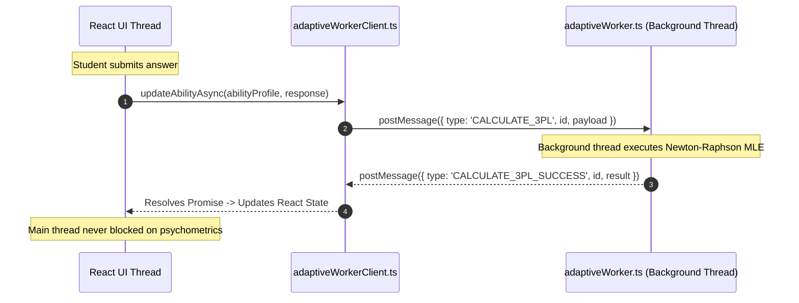
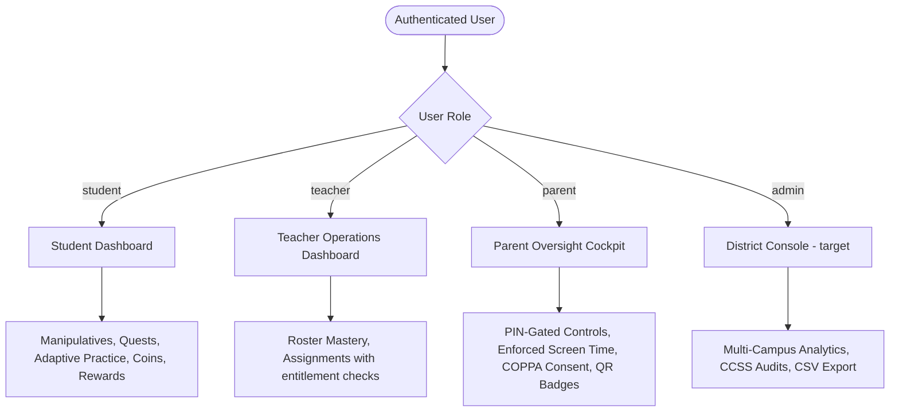

# AcuityMath System Blueprint & Engineering Handbook

> **Target Audience:** Future Software Engineers, AI Coding Agents, System Architects, District Technology Directors, and Pedagogical Researchers.
> **Repository Purpose:** Master architectural specification, pedagogical theory, technical facts, and operational playbook for the **AcuityMath Adaptive Learning Platform**.

---

## 📍 How to read this document

This is **the specification** — what AcuityMath is for and what it is meant to
become. It is not a report on what runs today.

Every section carries a status, so that a reader can tell the two apart without
opening the code:

| Marker | Meaning |
| :--- | :--- |
| ✅ **Built** | Implemented, tested, and enforced server-side where that matters |
| 🟡 **Partial** | Some of it runs; the section says which part |
| 🎯 **Target** | Specified, not yet built. Written here as intent, not as description |

Where this document and the code disagree, **this document is the intent and the
code is the truth about today**. `docs/ROADMAP.md` holds the distance between
them and the order of travel; `docs/MIGRATION_STATUS.md` holds what has landed
and the traps found on the way.

An earlier draft of this handbook described §7 and §8 in the present tense —
endpoint URLs, "integrates seamlessly", "compiled and verified" — for work that
had not started. The status markers exist so that cannot happen silently again.

---

## 📑 Table of Contents

1. [Executive Summary & Purpose](#1-executive-summary--purpose)
2. [Mission, Vision, and Core Pedagogical Values](#2-mission-vision-and-core-pedagogical-values)
3. [The 4 Developmental Age Tiers](#3-the-4-developmental-age-tiers-cognitive-scaffolding) ✅
4. [Psychometric & Mathematical Foundations (3PL IRT Core)](#4-psychometric--mathematical-foundations-3pl-irt-core) ✅
5. [Socratic AI Tutoring & Bilingual Scaffolding](#5-socratic-ai-tutoring--bilingual-scaffolding) ✅
6. [Hardware Performance & Chromebook Web Worker Offloading](#6-hardware-performance--chromebook-web-worker-offloading) ✅
7. [Institutional LMS & SIS Interoperability (LTI 1.3 & OneRoster)](#7-institutional-lms--sis-interoperability-lti-13--oneroster) 🎯
8. [Multi-Role User Architecture & Privacy Governance](#8-multi-role-user-architecture--privacy-governance) 🟡
9. [Technical Stack & Container Runtime Facts](#9-technical-stack--container-runtime-facts) ✅
10. [Codebase Anatomy & Directory Tour](#10-codebase-anatomy--directory-tour) ✅
11. [Build, Deployment, and Verification Lifecycle](#11-build-deployment-and-verification-lifecycle) ✅
12. [Golden Directives for Future Developers & AI Agents](#12-golden-directives-for-future-developers--ai-agents)

---

## 1. Executive Summary & Purpose

**AcuityMath** is an institutional-grade, age-adaptive K–12 mathematics learning
ecosystem. It spans learners aged 3 to 18 (Pre-K through Grade 12), transforming
mathematics education from a source of rote memorization and cognitive anxiety
into an inquiry-driven, mastery-based journey.

**The institutional direction is a layer, not a fork.** The learner product —
practice loop, manipulatives, Socratic coach, consent, screen time — is the
foundation, and it works standalone for a family that signs up on its own. The
institutional layer sits on top of it. Every guarantee made about a child's data
holds identically whether a parent or a district put them there.

### What Makes AcuityMath Different?

| Dimension | Conventional EdTech Platforms | AcuityMath | Status |
| :--- | :--- | :--- | :--- |
| **Difficulty Scaling** | Linear question banks or coarse grade-level filters | **Continuous 3PL Item Response Theory (IRT)** with maximum likelihood ability ($\theta$) calibration | ✅ |
| **AI Tutoring** | Direct answer bots or generic summarizers | **Strict Socratic Scaffolding** that guides without spoiling | ✅ |
| **Concept Intuition** | Static images or text descriptions | **Interactive HTML5/Canvas Manipulatives** following the Concrete-Representational-Abstract (CRA) model | ✅ |
| **Equity & Hardware** | Heavy client bundles that stutter on low-spec hardware | **Offloaded Web Worker psychometrics** for low-cost Chromebooks | ✅ |
| **Language Access** | Monolingual English or clunky full-page auto-translate | **Real-time In-Problem Dual-Language (EN/ES) Vocab Scanner** with native audio pronunciation | ✅ |
| **Enterprise Integration** | Walled-garden accounts requiring manual CSV imports | **LTI 1.3 Advantage** & **OneRoster 1.2 REST** for automated grade passback and rostering | 🎯 |
| **Student Privacy** | Hidden telemetry tracking & targeted analytics | Verifiable parental consent, **enforced**, with PIN-gated guardian controls and QR/picture logins | ✅ |

---

## 2. Mission, Vision, and Core Pedagogical Values

### 🎯 The Mission
To demystify mathematical thinking for every student across the entire
developmental continuum—from early childhood subitizing to advanced differential
calculus—by coupling **mathematically rigorous psychometrics** with **tactile
intuition**, **Socratic AI mentorship**, and **uncompromising digital privacy**.

### 🔭 The Vision
A world where educational disparities in mathematical achievement are eradicated:
- Where an English Language Learner in an underfunded district using an 8-year-old Chromebook experiences the **exact same responsive, individualized, 1-on-1 tutoring quality** as a student in a well-funded private academy.
- Where teachers spend less time grading static worksheets and more time orchestrating high-impact interventions informed by real-time latent ability data.
- Where parents and guardians are active, informed partners empowered by transparent, server-enforced screen time safeguards and actionable growth metrics.

### 🧠 Core Pedagogical Philosophies



1. **Concrete-Representational-Abstract (CRA) Progression**:
   Abstract mathematical notation ($3/4 + 1/2 = 5/4$, or $dy/dx = 2x$) is inaccessible without tactile foundations. AcuityMath roots every concept in concrete manipulation (interactive pizza slices, ten-frame counters, coordinate dragging) before bridging into symbolic abstractions.
2. **Zone of Proximal Development (ZPD)**:
   Problems are dynamically targeted at the boundary of student capability ($\theta \in [\theta_{\text{student}} - 0.2, \theta_{\text{student}} + 0.5]$). This prevents the dual pitfalls of disengagement: frustration from unachievable difficulty, and boredom from redundant mastery.
3. **Platonic Socratic Guidance**:
   The built-in AI tutor is prohibited from supplying final numeric answers. Instead, it poses cognitive questions, highlights underlying patterns, suggests physical manipulatives, and prompts metacognitive reflection.
4. **Growth Mindset & Error Normalization**:
   Misconceptions are categorized taxonomically (e.g., adding denominators, sign flipping, distribution neglect) rather than penalized as failures. Every error serves as a diagnostic data point that refines the student's mastery profile.

---

## 3. The 4 Developmental Age Tiers (Cognitive Scaffolding) ✅

AcuityMath structures the K–12 spectrum into 4 developmental tiers, each paired
with age-appropriate visual ergonomics, vocabulary density, manipulative tooling,
and psychometric calibration. Implemented in
`src/components/manipulatives/` — `EarlyMathLabs`, `ElementaryMathLabs`,
`SecondaryMathLabs`, behind `ManipulativesHub`.

### 1. Early Sprouts (Ages 3–5 | Pre-K & Kindergarten)
- **Cognitive Goal:** Subitizing (instantly seeing quantities without counting), 1-to-1 correspondence, and basic cardinal order.
- **Interactive Tooling:** Dual $2 \times 5$ Ten-Frames with clickable counters; Interactive Apple Tree with auditory counting synthesis on tap; geometric pattern sequences.
- **Accessibility:** Voice-narrated instructions (`en-US` and `es-US`), oversized touch targets ($\ge 64\text{px}$), and no textual literacy requirement.

### 2. Elementary Explorers (Ages 6–10 | Grades 1–5)
- **Cognitive Goal:** Conceptualizing parts-to-whole, base-ten place value, and operational fluidity.
- **Interactive Tooling:** Dynamic Fraction Pizza Slicer with real-time denominator slider ($2 \dots 12$) and equivalent-fraction proofs ($2/4 \equiv 1/2$); Base-Ten Blocks demonstrating regrouping; Number Line Jumpers for negatives and decimals.
- 🟡 **Content gap.** The manipulatives are built; the **authored corpus is thin here**, and age 7 has no authored problems at all. See §9 of `docs/ROADMAP.md`.

### 3. Middle School Navigators (Ages 11–13 | Grades 6–8)
- **Cognitive Goal:** Transitioning from concrete arithmetic to symbolic algebraic reasoning and proportional relationships.
- **Interactive Tooling:** Interactive Cartesian Coordinate System; real-time Linear Equation Plotter with draggable slope ($m$) and intercept ($b$) for $y = mx + b$; Algebraic Balance Scale for two-step equations ($2x + 4 = 12$).

### 4. High School Scholars (Ages 14–18 | Grades 9–12)
- **Cognitive Goal:** Advanced abstraction, continuous functions, rates of change, and rigorous modeling.
- **Interactive Tooling:** Real-Time Tangent Line Visualizer on $f(x) = x^2$ with movable probe computing $f'(x) = 2x$; Trigonometric Unit Circle with live $(\cos \theta, \sin \theta)$ mapping; matrix visualizers and polynomial curve fitters.

---

## 4. Psychometric & Mathematical Foundations (3PL IRT Core) ✅

Implemented in `src/services/adaptiveEngine.ts`, with the authoritative update
performed server-side in `server/learning/` inside the transaction that records
the attempt. The browser also evaluates the answer for immediate feedback; that
is a rendering concern, and the server's verdict is the one that counts.

### The Mathematical Formula

$$P_i(\theta) = P(X_i = 1 \mid \theta) = c_i + \frac{1 - c_i}{1 + \exp\left[-D \cdot a_i(\theta - b_i)\right]}$$

Where:
- **$\theta \in (-\infty, +\infty)$:** The student's latent mathematical trait (standardized $\mu = 0.0, \sigma = 1.0$, typically mapped within $[-3.0, +3.0]$).
- **$b_i \in [-3.0, +3.0]$ (Difficulty):** The ability at which probability of a correct response reaches $c_i + (1 - c_i)/2$.
- **$a_i > 0$ (Discrimination):** Slope of the Item Characteristic Curve at $b_i$.
- **$c_i \in [0, 1)$ (Pseudo-Guessing):** Lower asymptote (e.g. $0.25$ for 4-option multiple choice; $0.0$ for open numeric entry).
- **$D = 1.702$:** Scaling factor minimizing the difference between logistic and normal ogive curves.

### Newton-Raphson Maximum Likelihood Update

$$\theta^{(t+1)} = \theta^{(t)} + \frac{\frac{\partial \ln L}{\partial \theta}}{I(\theta^{(t)})}$$

$$I(\theta) = \sum_{i=1}^{N} \frac{\left[P_i'(\theta)\right]^2}{P_i(\theta) \cdot \left[1 - P_i(\theta)\right]} \qquad SEM(\theta) = \frac{1}{\sqrt{I(\theta)}}$$

`SEM` is floored at $0.18$ in the implementation: information accumulates without
bound, and an unfloored standard error eventually claims a precision no
seven-item instrument has.

### ELO Rating Mapping

🟡 **The specification and the implementation disagree, and this is tracked.**

- This document specifies $\text{ELO}(\theta) = 1000 + 250\theta$.
- `adaptiveEngine.ts` implements $1200 + 300\theta$, over a displayed range of 600–2400.

Both are defensible; what is not defensible is two answers to one question. See
**Track B3** in `docs/ROADMAP.md`. Whichever is chosen, the change is a migration
rather than an edit, because ratings are already displayed to learners.

### The 7-Item Diagnostic "Placement Quest" ✅
New learners are invited to a 7-item Placement Quest, converging $\theta$ from the
neutral prior ($\theta_0 = 0.0, SEM = 1.0$) toward a calibrated baseline so that
subsequent practice starts inside their Zone of Proximal Development. Live
$\theta$ and $SEM$ are surfaced during the quest.

---

## 5. Socratic AI Tutoring & Bilingual Scaffolding ✅

### Socratic AI Mentorship (Google Gemini)
Server-side integration via `server/gemini.ts`, using model **`gemini-3.8-flash`**,
bound to strict pedagogical guardrails:

```
                                PROMPT PIPELINE
+-------------------------------------------------------------------------------+
| Input: Student Ability Profile (θ) + Problem Context + Student Incorrect Step  |
+-------------------------------------------------------------------------------+
                                       |
                                       v
+-------------------------------------------------------------------------------+
| System Guardrail Instructions:                                                |
| 1. NEVER give the final numerical answer or write out the full solution.      |
| 2. Diagnose the cognitive misconception from the student's input.             |
| 3. Provide exactly ONE short conceptual question (<= 25 words).               |
| 4. Suggest an interactive physical manipulative if applicable.                |
| 5. Maintain an encouraging, playful, growth-mindset tone.                     |
+-------------------------------------------------------------------------------+
                                       |
                                       v
+-------------------------------------------------------------------------------+
| Output: Socratic Hint Card (e.g. "What happens to the slice size when you     |
|         cut a pizza into 8 slices instead of 4? Try using the pizza slider!") |
+-------------------------------------------------------------------------------+
```

**The fallback labels itself.** When the model is unreachable, a deterministic
engine answers and stamps `source: 'socratic-engine-fallback'` rather than
`'gemini-3.8-flash'`, and the UI renders that source. A fallback is fine; an
unlabelled one would make a failure indistinguishable from success.

### Dual-Language (English ⟷ Español) Scaffolding
1. **In-Problem Real-Time Vocab Scanner (`BilingualTextHighlighter.tsx`)** — analyzes problem text against mathematical keywords (*numerator/denominador*, *perimeter/perímetro*, *hypotenuse/hipotenusa*, *slope/pendiente*), underlines matches, and on tap shows English and Spanish terms with native text-to-speech, definitions, cognates, and a jump to the full glossary.
2. **Dual-Language Math Glossary Modal (`BilingualGlossaryModal.tsx`)** — searchable dictionary across all four tiers, filtered by Arithmetic, Foundations, Geometry, Algebra and Calculus.

---

## 6. Hardware Performance & Chromebook Web Worker Offloading ✅

### The Real-World District Challenge
Public school classrooms lean heavily on low-cost **Chromebooks** (commonly 2–4 GB
RAM, dual-core Celeron-class processors). Running Newton-Raphson MLE iterations
and Fisher information integration on the browser's UI thread causes frame drops,
input latency, and sluggish manipulative rendering.

### The Solution: Dedicated Background Web Worker



### Resilient Client Architecture (`src/utils/adaptiveWorkerClient.ts`)
- **Worker Initialization:** dedicated worker via `new Worker(new URL('../workers/adaptiveWorker.ts', import.meta.url), { type: 'module' })`.
- **Request-Response Correlator:** unique request IDs map outgoing calls to their results, so concurrent requests cannot cross.
- **Fail-Safe Timeout & Main-Thread Fallback:** if the worker is blocked, terminated by OS memory reclamation, or exceeds its threshold, the client executes the calculation synchronously on the main thread rather than hanging.

---

## 7. Institutional LMS & SIS Interoperability (LTI 1.3 & OneRoster) 🎯

> **Status: Target. None of this is built.** There is no LTI, OIDC, JWT-platform
> or OneRoster code in the repository. `LtiOnboardingWizardModal.tsx` renders a
> configuration form and makes no network calls. The endpoint paths below are
> **specified, not served**, and `acuitymath.org` is not yet registered to this
> project.
>
> The work is sequenced as **Track C** and **Track D** in `docs/ROADMAP.md`.
> Certification is **Track A** and is not engineering: LTI Advantage conformance
> requires 1EdTech membership and passing their suite per service.

The intended shape:

```mermaid
flowchart LR
    SIS["District SIS (PowerSchool / Infinite Campus)"]
    LMS["Institutional LMS (Canvas / Schoology / Google Classroom)"]
    Acuity["AcuityMath"]

    SIS -->|OneRoster 1.2 REST API| Acuity
    LMS <-->|LTI 1.3 Advantage Core (OIDC + JWT)| Acuity
    Acuity -->|AGS v2.0 Gradebook Passback| LMS
    LMS -->|Deep Linking 2.0 Assignment Selection| Acuity
```

### 1. LTI 1.3 Advantage Suite — intended scope
- **LTI Core Launch:** OpenID Connect third-party launch using RSA-256 signed JWTs for single sign-on.
- **Assignment & Grade Services (AGS v2.0):** score, progress and mastery passback into institutional gradebooks.
- **Names and Role Provisioning (NRPS):** roster retrieval from the platform.
- **Deep Linking 2.0:** teachers embed specific AcuityMath quests or manipulatives into LMS modules.
- **Planned endpoints** (not yet served): launch, OIDC initiation, and a public JWKS keyset under `/api/lti/`.

**Consent must not be bypassed by a launch.** An LTI-provisioned pupil is
provisioned *through* `recordConsent` with method `institutional_agreement` —
already a valid value in `consent_events` — so the existing consent gate applies
to them exactly as it applies to a self-serve family. A launch that wrote
attempts without a consent row would defeat §8.

### 2. OneRoster 1.2 REST Integration — intended scope
Scheduled synchronization of schools, academic sessions, courses, classes,
enrollments and teacher rosters. Reconciliation must be idempotent: running it
twice changes nothing the second time, and a pupil removed at the SIS is
deactivated rather than deleted.

### 3. Self-Serve Integration Wizard
`LtiOnboardingWizardModal.tsx` exists as an interface. Its configuration export
and handshake testing are **target behaviour**, not current behaviour.

---

## 8. Multi-Role User Architecture & Privacy Governance 🟡



### The Stakeholder Views

1. **Student Learner View** ✅ — gamified mastery cockpit with coin economy, streaks and avatars; Placement Quest, adaptive practice, scratchpad. Coins, XP and streaks are **written server-side**; avatar prices come from the server catalogue, not the browser.
2. **Teacher & Faculty View** ✅ — roster dashboard from the learners' own attempts; assignments as rows with a **server-side entitlement rule**.
3. **Parent & Guardian Cockpit** ✅
   - **PIN-Protected Entry** — step-up elevation using **scrypt with lockout**. PINs are never compared in plaintext.
   - **Screen Time Governance** — daily allowances **measured and enforced by the server**. The heartbeat carries no duration, because a counter the client increments is one the restricted child can decline to increment.
   - **COPPA Consent Management** — an append-only ledger against the exact policy version and a server-computed hash of the text displayed.
   - **Student QR & Picture Cards** — printable login cards for young learners.
4. **District Administrator Console** 🎯 — multi-campus comparison, CCSS alignment, and export suite. `DistrictAdminDashboard.tsx` exists but is **unrouted and unreachable**: it seeds invented campuses into its own state and was quarantined for that reason. It is a design reference; the data layer beneath it is **Track B1/E** in `docs/ROADMAP.md`.

### Legal Privacy Framework

> **Status: implemented controls ✅, certifications 🎯.** The distinction matters
> and is stated rather than blurred.

**What is implemented today:**
- **Verifiable parental consent, recorded and enforced.** A consent is a row, tied to the policy version and a server-computed hash of the disclosure. Consent given under a **superseded** policy version does not count as consent.
- **Recording is gated on it.** An under-13 without consent can still practise — questions are generated in the browser and **nothing leaves the device** — and the child is told so. The server refuses the write rather than accepting and discarding it.
- **No behavioral tracking, no third-party advertising, no analytics telemetry.**
- **Role-based access control enforced server-side.** A learner outside the caller's family answers `NOT_FOUND` rather than `FORBIDDEN`, so the platform's children cannot be enumerated.

**What is not held:**
- **COPPA Safe Harbor certification.** Safe Harbor is a formal FTC-approved programme; the controls above are real, the certification is **Track A**.
- **A FERPA attestation.** FERPA binds *schools*, not vendors. What a vendor supplies is a Data Protection Addendum, a data map, a subprocessor list and breach terms — **Track A**.
- **Transport and at-rest encryption are deployment concerns** and are not configured in this repository.

---

## 9. Technical Stack & Container Runtime Facts ✅

> [!CAUTION]
> **CRITICAL RUNTIME ENVIRONMENT FACTS**
> - **Port 3000 is the only externally accessible port.** `server.ts` binds `0.0.0.0:3000`. Never read or override `PORT`.
> - **API keys must remain server-side.** Never prefix secrets with `VITE_`. Proxy all Gemini calls through the server.
> - **A database is required.** There is no local-file fallback by design: a silent one presents an empty database as a working install.
> - **A static-only deploy is not a limited AcuityMath — it is the appearance of one.** The build produces a client *and* `dist/server.cjs`. A host that serves only the static output never runs the server, and auth, the consent gate, screen time and entitlement all vanish with it.

### Complete Technology Matrix

| Layer | Technology | Version | Architectural Function |
| :--- | :--- | :--- | :--- |
| **Runtime** | Node.js | `22.x` (CI) | Server runtime |
| **Language** | TypeScript | `~5.8.2` | End-to-end type safety |
| **Frontend Framework** | React | `^19.0.1` | Component UI hierarchy |
| **Build Tool** | Vite | `^6.2.3` | Client compilation and HMR |
| **Server Bundler** | esbuild | `^0.25.0` | Compiles `server.ts` to a CommonJS bundle |
| **Server Framework** | Express | `^4.21.2` | HTTP host, Vite middleware, small REST surface |
| **Application API** | tRPC | `^11.18.0` | **The API.** Typed procedures with server-side authorization |
| **Database** | MySQL | `8.4` | Learners, attempts, mastery, consent, screen time |
| **ORM & Migrations** | Drizzle | `^0.44.7` | Schema, typed queries, generated migrations |
| **Package Manager** | pnpm | `11.21.0` | Pinned via `packageManager` |
| **Testing** | Vitest | — | 40 test files; integration suites require `DATABASE_URL` |
| **Content Gate** | Python + SymPy | `3.12` | Symbolic verification of authored answers, in CI |
| **CSS & Styling** | Tailwind CSS | `^4.1.14` | Utility styling |
| **Icons** | Lucide React | `^0.546.0` | Accessible icon library |
| **AI SDK** | Google GenAI | `^2.4.0` | Server-side Socratic tutoring |
| **Background Thread** | Web Workers | Native | Non-blocking 3PL psychometrics |
| **Offline** | IndexedDB | Native | Answer queue with per-learner `client_id` idempotency |
| **Audio** | Web Audio & Speech | Native | Synth tones and dual-language TTS |

---

## 10. Codebase Anatomy & Directory Tour ✅

```
/
├── ARCHITECTURE.md               # This document — the specification
├── README.md                     # Public overview; claims only what is built
├── .env.example                  # DATABASE_URL, JWT_SECRET, GEMINI_API_KEY, SMTP
├── server.ts                     # Express host; Vite middleware in development
│
├── drizzle/
│   ├── schema.ts                 # MySQL schema
│   ├── migrations/               # Generated, applied in order
│   ├── schema.test.ts            # Shape assertions
│   ├── writers.test.ts           # Every table must have a writer
│   └── database.integration.test.ts
│
├── server/
│   ├── trpc/routers.ts           # The application API
│   ├── trpc/index.ts             # protected / learner / elevated procedures
│   ├── auth/                     # Magic links, sessions, step-up PIN (scrypt)
│   ├── learning/                 # Attempts, mastery, rewards, consent, consent gate, screen time
│   ├── curriculum/               # Corpus import, age banding
│   ├── test-support/             # Per-suite databases, consent fixtures
│   ├── api.ts                    # Small REST surface: health, consent 410, AI proxy
│   ├── gemini.ts                 # Socratic coach proxy
│   └── legacyApi.test.ts         # Pins the REST surface at 3 routes
│
├── scripts/
│   ├── audit-generator.ts        # Content integrity gate (structural + SymPy)
│   ├── seed-curriculum.ts        # Authored corpus import
│   └── seed-demo-family.ts       # Demonstration family, with consent recorded
│
├── src/
│   ├── App.tsx                   # Application shell and modal routing
│   ├── components/               # Views, modals, manipulatives/
│   ├── hooks/                    # usePractice, useConsent, useScreenTime, useRecordingPermission, useStepUp
│   ├── offline/                  # IndexedDB queue and reconciler
│   ├── data/                     # Curriculum, bilingual glossary, consent policy, avatars
│   ├── services/                 # adaptiveEngine (3PL), problemGenerator, api (coach only)
│   ├── utils/                    # adaptiveWorkerClient, audio, screenTime, storage
│   └── workers/adaptiveWorker.ts # Background psychometrics
│
└── docs/
    ├── MIGRATION_STATUS.md       # What landed, decisions settled, and the traps found
    ├── ROADMAP.md                # The plan from here to this document
    ├── AUDIT_REPORT.md           # Initial architectural audit
    ├── GENERATOR_INTEGRITY.md    # How authored answers are verified
    ├── PHASE_1_PLAN.md           # Security, Persistence & Compliance
    ├── PHASE_2_PLAN.md           # Interactive Virtual Math Manipulatives
    ├── PHASE_3_PLAN.md           # Socratic AI Math Coach & Generator
    └── PHASE_4_PLAN.md           # Enterprise LMS Integration & LTI
```

> **On the phase plans.** An earlier draft of this tour mapped Phase 2 to
> District Administration & LMS, Phase 3 to IRT, and Phase 4 to manipulatives.
> The files say otherwise, and so does `AUDIT_REPORT.md`: **LMS integration is
> Phase 4 — last.** The scaffold built the district dashboard first anyway. If
> the institutional layer is now to be brought forward, that should be a decision
> taken deliberately rather than one inherited from a mislabel.

---

## 11. Build, Deployment, and Verification Lifecycle ✅

### Scripts

```bash
pnpm dev                 # tsx server.ts — Vite mounted as Express middleware
pnpm build               # vite build && esbuild server.ts -> dist/server.cjs
pnpm start               # node dist/server.cjs
pnpm lint                # tsc --noEmit
pnpm test                # Vitest
pnpm audit:generator     # Content integrity gate
pnpm db:migrate          # Apply migrations
pnpm db:seed             # Authored corpus
pnpm db:seed:demo        # Demonstration family, consent included
```

### Database

Port 3307 deliberately, so it does not collide with a local MySQL on 3306.

```bash
docker run -d --name acuitymath-mysql \
  -e MYSQL_ROOT_PASSWORD=root -e MYSQL_DATABASE=acuitymath \
  -p 3307:3306 mysql:8.4
```

### Verification, and one trap

```bash
pnpm lint && pnpm test && pnpm build
```

**A green `pnpm test` with no `DATABASE_URL` is not full coverage** — the
integration suites skip themselves and the run still reports success. They throw
rather than skip when `CI` is set, so a pipeline cannot go green by skipping.
Verify against a database migrated to **your own branch's** level; the shared dev
database is not reset between checkouts. See *Getting running again* in
`docs/MIGRATION_STATUS.md`.

---

## 12. Golden Directives for Future Developers & AI Agents

If you are a software engineer or an AI coding agent maintaining, extending or
refactoring this codebase, you **MUST** uphold these principles:

1. **Security & API Keys Are Exclusively Server-Side:**
   Never import `@google/genai` on the client. Never expose `GEMINI_API_KEY` to Vite (do NOT add `VITE_GEMINI_API_KEY`). All AI features execute server-side and are exposed via `/api/*`.
2. **Strict Port 3000 Ingress Binding:**
   Never alter port configuration or read `process.env.PORT`. The server binds `0.0.0.0:3000`.
3. **Preserve the Chromebook Web Worker Architecture:**
   Do not introduce heavy synchronous calculation loops to the React UI thread. Psychometric updates must be piped through `adaptiveWorkerClient.ts`.
4. **Enforce the Socratic Directive:**
   When tuning AI prompts, never allow the model to deliver direct numeric answers. The platform's pedagogy depends on guided inquiry, misconception diagnosis, and self-directed discovery.
5. **Honor the CRA Manipulative Bridge:**
   When introducing new lessons or problem generators, always pair symbolic notation with a visual or interactive manipulative.
6. **Maintain Strict Privacy Compliance (COPPA & FERPA):**
   Never add tracking pixels, third-party analytics cookies, or unvetted data collection. Protect student privacy with the rigor of banking software.
7. **Bilingual Equity Standard:**
   When adding new mathematical concepts, always supply parallel Spanish terminology, definitions, and phonetics in `bilingualGlossaryData.ts`.
8. **Verify with the project's own commands, and claim only what you checked:**
   ```bash
   pnpm lint && pnpm test && pnpm build
   ```
   Integration suites skip silently without `DATABASE_URL`, so a green run is not
   necessarily a covered one. **A gate is not working until it has been made to
   fail on purpose** — change the code it guards and watch it break before
   reporting it as protection. And when writing here, mark intent as intent: this
   document distinguishes ✅ Built from 🎯 Target for a reason, and a section that
   describes unbuilt work in the present tense is how the first draft of it came
   to claim certifications the product does not hold.

---

*The specification. `docs/ROADMAP.md` holds the plan to reach it;
`docs/MIGRATION_STATUS.md` holds what has landed.*
