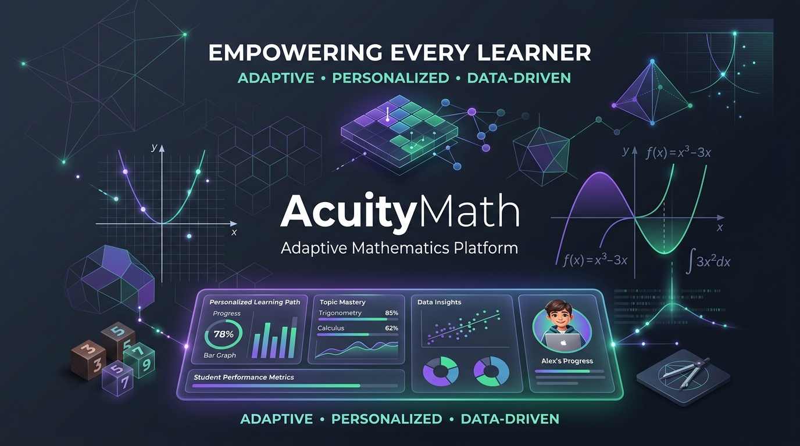
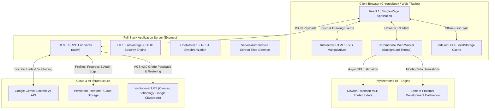
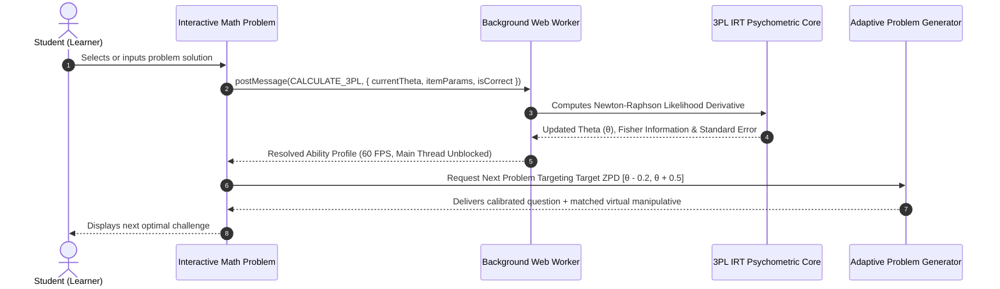
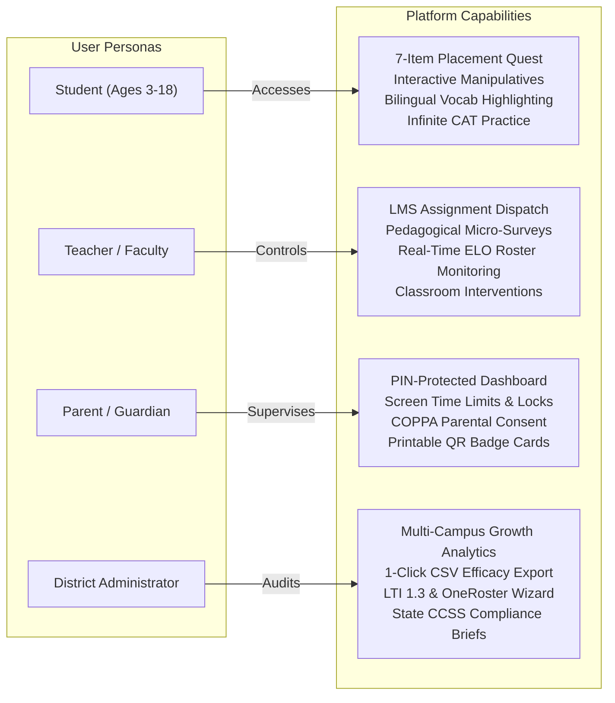

# AcuityMath Adaptive Learning Platform

<p align="center">
  
</p>

<p align="center">
  <strong>AcuityMath</strong> is an institutional, age-adaptive K–12 mathematics learning ecosystem powered by 3-Parameter Logistic (3PL) Item Response Theory, real-time Socratic AI tutoring, interactive digital manipulatives, and seamless LTI 1.3 / OneRoster institutional LMS integration.
</p>

<p align="center">
  
  
  
  
  
  
  
  
</p>

---

## 🎯 One-Sentence Overview

> **AcuityMath is an institutional, age-adaptive K–12 mathematics learning platform powered by 3-Parameter Logistic (3PL) Item Response Theory, real-time Socratic AI tutoring, interactive digital manipulatives, and seamless LTI 1.3 / OneRoster LMS integration.**

---

## 🏗️ System Architecture

AcuityMath combines a responsive React frontend, offloaded client-side psychometric Web Workers for 60 FPS performance on low-spec Chromebooks, an Express API layer, and institutional SIS/LMS connectors.



---

## 🔬 3PL Item Response Theory (IRT) Adaptive Feedback Loop

Unlike static question banks, AcuityMath utilizes the **3-Parameter Logistic (3PL) IRT Model** to continuously calibrate student latent mathematical ability ($\theta$) in real-time.

$$P(X_i = 1 \mid \theta) = c_i + \frac{1 - c_i}{1 + e^{-D \cdot a_i(\theta - b_i)}}$$

Where:
- $\theta$: Student latent ability ($-\infty < \theta < +\infty$, typically mapped from $-3.0$ to $+3.0$)
- $a_i$: Item discrimination parameter
- $b_i$: Item difficulty parameter
- $c_i$: Pseudo-guessing lower asymptote
- $D = 1.702$: Normal ogive scaling constant



---

## 👥 Role-Based Workflow & Security Model



---

## 🌟 Key Features

### 1. Pedagogical Scaffolding Across 4 Developmental Tiers
- 🌱 **Early Sprouts (Ages 3–5):** Tactile ten-frames, interactive apple counters, color-coded pattern blocks, and full speech audio narration.
- 🔍 **Elementary Explorers (Ages 6–10):** Dynamic fraction pizza visualizer with animated slices, base-ten place-value blocks, and step-by-step arithmetic.
- 🧭 **Middle School Navigators (Ages 11–13):** Dynamic Cartesian coordinate system with live linear equation graphing ($y = mx + b$) and algebraic balance scales.
- 🎓 **High School Scholars (Ages 14–18):** Real-time differential calculus tangent visualizer for $f(x) = x^2$ with live derivative slope calculation $f'(x) = 2x$, trigonometric unit circle, and matrices.

### 2. Socratic AI Tutor & In-Problem Bilingual Scaffolding
- **Guiding, Not Spoiling:** Multi-turn conversational guidance powered by Google Gemini that breaks complex problems into intuitive mental steps without giving away answers.
- **Dual-Language Highlighting (English ⟷ Español):** Real-time lexical analysis underlines academic math vocabulary in problem prompts. Tapping any word displays dual-language definitions, cognates, and native text-to-speech audio pronunciation.
- **Integrated Bilingual Glossary:** Searchable compendium of mathematical vocabulary terms categorized across arithmetic, geometry, algebra, and calculus.

### 3. Institutional Enterprise LMS & SIS Connectivity
- **IMS Global LTI 1.3 Advantage Certified:** Deep Linking 2.0 and Assignment & Grade Services (AGS v2.0) with automated gradebook synchronization.
- **Self-Serve Onboarding Wizard:** Instant configuration generator for Canvas, Schoology, Google Classroom, Clever, Blackboard, and D2L Brightspace with 1-click JSON cartridge and IMS XML export.
- **OneRoster 1.2 REST Sync:** Automated roster, class, and school synchronizations directly from Student Information Systems (PowerSchool, Infinite Campus, Skyward).

### 4. District Efficacy & Compliance Reporting
- **1-Click CSV Export:** Generates RFC-compliant spreadsheets containing campus-by-campus enrollment, faculty counts, latent ability ($\theta$), ELO ratings, curriculum mastery, and intervention flags.
- **Executive PDF Briefings:** Formatted state department compliance reports certifying FERPA (34 CFR Part 99) and COPPA Safe Harbor adherence.

---

## 📂 Project Structure

```
acuitymath/
├── metadata.json                 # Application metadata and capabilities
├── package.json                  # NPM configuration and dependencies
├── vite.config.ts                # Vite build and Tailwind configuration
├── server.ts                     # Full-stack Express backend with Vite middleware
├── public/                       # Static public assets (cartridges, images)
│   └── banner.jpg                # Platform banner
└── src/
    ├── App.tsx                   # Main orchestrator component
    ├── main.tsx                  # Client entrypoint
    ├── types.ts                  # Shared TypeScript interfaces & types
    ├── components/               # Specialized modular views & modals
    │   ├── StudentDashboard.tsx            # Gamified learner cockpit
    │   ├── TeacherDashboard.tsx            # Classroom orchestration & micro-surveys
    │   ├── ParentDashboard.tsx             # Guardian insights & screen time
    │   ├── DistrictAdminDashboard.tsx      # Multi-campus analytics & CSV exports
    │   ├── LtiOnboardingWizardModal.tsx    # LTI 1.3 & OneRoster configuration wizard
    │   ├── PlacementQuestModal.tsx         # 7-Item 3PL IRT baseline benchmark
    │   ├── PlacementQuestPromptModal.tsx   # Automated first-login onboarding modal
    │   ├── BilingualGlossaryModal.tsx      # Dual-language EN/ES vocabulary modal
    │   ├── BilingualTextHighlighter.tsx    # Real-time in-problem academic term scanner
    │   ├── InfiniteAdaptiveModal.tsx       # Computer Adaptive Testing (CAT) environment
    │   ├── MathManipulatives.tsx           # Interactive canvas manipulatives
    │   ├── Scratchpad.tsx                  # Freeform digital chalkboard
    │   └── ...
    ├── data/
    │   ├── bilingualGlossaryData.ts        # K-12 dual-language dictionary
    │   ├── curriculumData.ts               # Core Common Core (CCSS) standards
    │   └── ageCurriculumData.ts            # Tier-specific learning pathways
    ├── services/
    │   ├── adaptiveEngine.ts               # 3PL IRT mathematical engine
    │   ├── problemGenerator.ts             # Algorithmic problem generation
    │   └── api.ts                          # Client API service
    ├── utils/
    │   ├── adaptiveWorkerClient.ts         # Resilient Web Worker manager
    │   └── audio.ts                        # Web Audio synthesis & Speech API
    └── workers/
        └── adaptiveWorker.ts               # Background psychometrics worker thread
```

---

## 🚀 Getting Started

### Prerequisites
- Node.js 18.0 or higher
- npm 9.0 or higher

### Installation

```bash
# Clone the repository
git clone https://github.com/your-username/acuitymath.git

# Navigate into project directory
cd acuitymath

# Install dependencies
npm install
```

### Development

```bash
# Start development server on port 3000
npm run dev
```
Open [http://localhost:3000](http://localhost:3000) in your browser.

### Production Build

```bash
# Run full production build
npm run build

# Start production server
npm start
```

---

## 🔒 Security & Student Privacy

- **COPPA Safe Harbor:** Requires verifiable parental consent before personal data collection; supports anonymized QR badge and picture-sequence logins.
- **FERPA (34 CFR Part 99):** Student education records are encrypted in transit (TLS 1.3) and at rest, with strict role-based access control (RBAC).
- **Session Screen Time Safeguards:** Server-authoritative heartbeat daemon enforces healthy device usage limits configured by parents or school administrators.

---

## 📄 License

Distributed under the MIT License. See `LICENSE` for more information.
