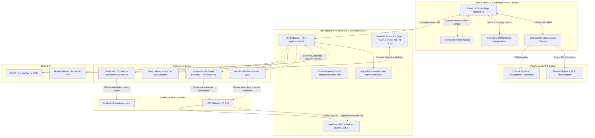
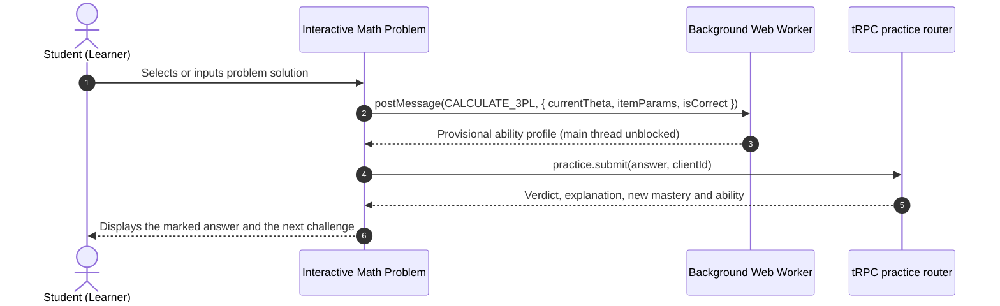
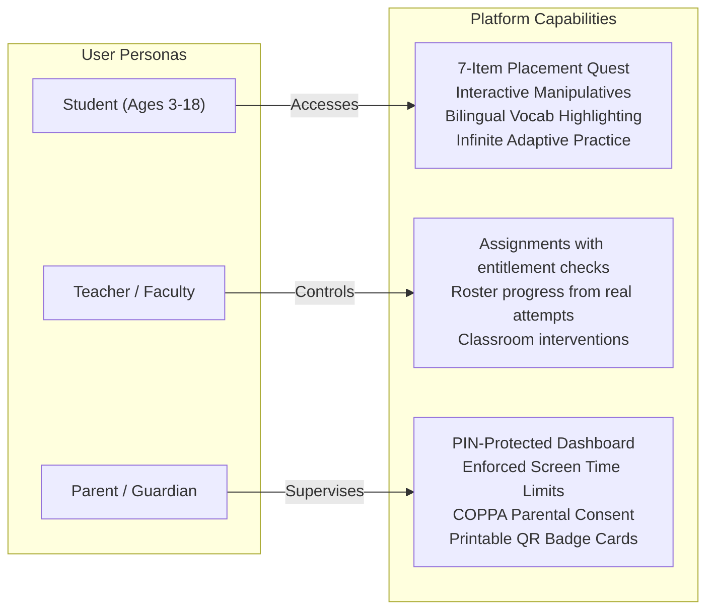

# AcuityMath Adaptive Learning Platform

<p align="center">
  
</p>

<p align="center">
  <strong>AcuityMath</strong> is an age-adaptive K–12 mathematics learning platform powered by 3-Parameter Logistic (3PL) Item Response Theory, real-time Socratic AI tutoring, and interactive digital manipulatives.
</p>

<p align="center">
  
  
  
  
  
  
  <a href="./ARCHITECTURE.md"></a>
</p>

---

## 📖 Complete Developer & AI Agent Blueprint

For the platform mission, pedagogical theory (CRA, ZPD, and the 3PL IRT
formulation), the Chromebook Web Worker offloading rationale, the multi-role
security model, and the container runtime facts, see the
**[AcuityMath System Blueprint & Engineering Handbook](./ARCHITECTURE.md)**.

**It is the specification, not a report on what runs today** — every section is
marked ✅ Built, 🟡 Partial or 🎯 Target, so intent and implementation can be told
apart without opening the code. Two companions:

- **[docs/ROADMAP.md](./docs/ROADMAP.md)** — the distance from here to that document, and the order of travel.
- **[docs/MIGRATION_STATUS.md](./docs/MIGRATION_STATUS.md)** — what has landed, the decisions that are settled, and the traps that cost time so they do not cost it twice.

---

## 🎯 One-Sentence Overview

> **AcuityMath is an age-adaptive K–12 mathematics learning platform powered by 3-Parameter Logistic (3PL) Item Response Theory, real-time Socratic AI tutoring, and interactive digital manipulatives.**

---

## 🏗️ System Architecture

A React single-page application, client-side psychometric Web Workers to keep the
main thread free on low-spec Chromebooks, and a tRPC API over MySQL.



---

## 🔬 3PL Item Response Theory (IRT) Adaptive Feedback Loop

Unlike static question banks, AcuityMath uses the **3-Parameter Logistic (3PL) IRT Model** to continuously calibrate student latent mathematical ability ($\theta$) in real time.

$$P(X_i = 1 \mid \theta) = c_i + \frac{1 - c_i}{1 + e^{-D \cdot a_i(\theta - b_i)}}$$

Where:
- $\theta$: Student latent ability ($-\infty < \theta < +\infty$, typically mapped from $-3.0$ to $+3.0$)
- $a_i$: Item discrimination parameter
- $b_i$: Item difficulty parameter
- $c_i$: Pseudo-guessing lower asymptote
- $D = 1.702$: Normal ogive scaling constant

Correctness and mastery are decided **server-side**, inside the transaction that
records the attempt. The browser also evaluates the answer so feedback is
immediate; that is a rendering concern, and the server's answer is the one that
counts.



---

## 👥 Role-Based Workflow & Security Model



A fourth role, **institution administrator**, reaches one district and no
further. Scope is read from the database on every check rather than carried in
the session, because a session lasts thirty days and somebody removed from a
district must stop reaching it that afternoon.

---

## 🌟 Key Features

### 1. Pedagogical Scaffolding Across 4 Developmental Tiers
- 🌱 **Early Sprouts (Ages 3–5):** Tactile ten-frames, interactive apple counters, color-coded pattern blocks, and full speech audio narration.
- 🔍 **Elementary Explorers (Ages 6–10):** Dynamic fraction pizza visualizer with animated slices, base-ten place-value blocks, and step-by-step arithmetic.
- 🧭 **Middle School Navigators (Ages 11–13):** Dynamic Cartesian coordinate system with live linear equation graphing ($y = mx + b$) and algebraic balance scales.
- 🎓 **High School Scholars (Ages 14–18):** Real-time differential calculus tangent visualizer for $f(x) = x^2$ with live derivative slope calculation $f'(x) = 2x$, trigonometric unit circle, and matrices.

### 2. Socratic AI Tutor & In-Problem Bilingual Scaffolding
- **Guiding, Not Spoiling:** Multi-turn conversational guidance powered by Google Gemini that breaks complex problems into intuitive mental steps without giving away answers. When the API is unreachable it falls back to a deterministic engine and **labels the reply as a fallback** rather than passing it off as the coach.
- **Dual-Language Highlighting (English ⟷ Español):** Real-time lexical analysis underlines academic math vocabulary in problem prompts. Tapping any word displays dual-language definitions, cognates, and native text-to-speech audio pronunciation.
- **Integrated Bilingual Glossary:** Searchable compendium of mathematical vocabulary terms categorized across arithmetic, geometry, algebra, and calculus.

### 3. Verified Content, and a Generator for the Gaps
- **64 concepts, 1,154 authored problems, 584 hints** in the authored corpus — computed from `data/curriculum/` by `server/curriculum/contentCoverage.ts`, not copied here by hand. Counting rows in a development database gives a different and wrong answer, because generator output is persisted as it is served. Every authored answer is checked by a two-part integrity gate — a structural pass and a symbolic pass using SymPy — which runs in CI and fails the build.
- **The generator covers what the corpus does not**, at runtime, for ages the authored set does not reach.
- **Known gap:** ages 6–10 are thin. Age 7 had no authored problems at all until `counting-to-20` landed, and now has one concept of the seven drafted for it. See `docs/MIGRATION_STATUS.md`.

### 4. Institutional Integration — LTI 1.3 Advantage and OneRoster

- **LTI 1.3 Advantage, implemented end to end.** OIDC third-party initiation
  (both verbs, because platforms disagree), RS256 launch validation against the
  platform's keyset, a published JWKS with rotation, Names and Roles roster
  sync, Assignment and Grade Services score posting, and Deep Linking with a
  picker a teacher actually chooses from.
- **A pupil launching from an LMS is provisioned and consented in one act**, under
  their district's agreement — or refused with a reason, if the district has not
  signed or the placement names no year group. A child is never created without
  consent recorded in the same transaction.
- **OneRoster 1.2 is *consumed*, not served.** This product reads a district's
  student information system — orgs become campuses, classes become classrooms,
  enrolments become class lists — and reconciles them idempotently. It does not
  expose a OneRoster API of its own, and nothing is served at
  `/api/oneroster/v1p2`.
- **A roster sync never deletes a child, never creates an adult account, and
  never infers a departure from an incomplete read.** It deactivates a pupil the
  source explicitly marks as gone, and restores them if it was the sync that
  deactivated them — never one a person hid deliberately.

**What has not happened:** no conformance suite has been run, because that
requires 1EdTech membership; and no real LMS or SIS has ever been connected,
because there are no deployments. Every test above runs against a purpose-built
platform that checks signatures, refuses bad tokens and paginates — which proves
the implementation, not the interoperability.

### 5. District Surfaces That Are Reachable

- **A district console** at `/district/<id>`, derived from real attempts by the
  same code that serves parents.
- **A full per-child export and real deletion** — removing a child's practice
  history rather than hiding it — both reachable from the console behind a PIN,
  with removal requiring the child's name to be typed.
- **A district-wide CSV**, RFC 4180, hardened against the spreadsheet formula
  injection that a name arriving from somebody else's SIS can otherwise carry.
- **A standards audit that reports the gap rather than a matrix**, because no
  authored concept carries a curriculum standard code yet. See *Not built*.

### 4. Child-Safety Controls That Are Enforced
- **Parental consent is recorded and enforced.** Consent is a row in `consent_events` with a server-computed hash of the exact disclosure text shown. For under-13s **without** consent, practice still works — questions are generated in the browser and nothing leaves the device — and the child is told so.
- **Screen-time limits are measured by the server.** The beat carries no duration: the server measures the interval itself, because a counter the client increments is one the child it restricts can decline to increment.
- **Step-up PIN elevation** (scrypt, with lockout) guards anything that touches a child's records.

---

## 🚧 Not built

Stated plainly, because two earlier versions of this README were wrong in
opposite directions — one claimed integrations that did not exist, and the one
that corrected it went on denying them after they were built.

- **No certification of any kind.** The product implements parental consent,
  institutional agreements and server-side access control. It has **not** been
  certified under COPPA Safe Harbor, no FERPA attestation has been made, and
  **1EdTech's LTI conformance suite has never been run** — that requires paid
  membership, which is deliberately deferred until the product stops changing
  shape. Implementing a specification is not the same as being certified
  against it, and this document will not blur the two.
- **No real LMS or SIS has ever been connected.** There are no deployments and
  no public instance. The LTI and OneRoster code is exercised against
  purpose-built platforms that verify signatures, reject bad tokens and
  paginate — which demonstrates the implementation and says nothing about any
  named product.
- **No curriculum standards mapping.** Fifty-one authored concepts carry **no**
  standard code; the twelve that do are the generator's, and they are precisely
  the twelve with no authored problems. `standardsCoverage.ts` reports that
  position rather than drawing a matrix of zeros, and the mapping itself is
  authoring work tracked as F3.
- **No PDF compliance briefing.** A console and a CSV cover what it was for; it
  should be argued for before it is built.
- **Age 7 has one authored concept**, `counting-to-20`, and had none at all
  until it landed — it was the only year between 3 and 18 with nothing. Three
  generator concepts still serve it alongside, which is correct mathematics and
  a much narrower year. Six more concepts are drafted and unwritten. Tracked as
  F2.
- **No TLS configuration and, with one exception, no at-rest encryption.** TLS
  is expected to terminate at whatever fronts the application. The exception is
  `oneroster_providers.client_secret_sealed`, which is AES-256-GCM and which
  the application **refuses to write at all** without a key configured to seal
  it — a district's SIS credential is not something to hold badly.

The institutional direction is **chosen**, not open: see `docs/ROADMAP.md` §1.

---

## 📂 Project Structure

```
acuitymath/
├── server.ts                     # Express host, Vite middleware in development
├── drizzle/
│   ├── schema.ts                 # MySQL schema (Drizzle)
│   ├── migrations/               # Generated, applied in order
│   └── writers.test.ts           # Asserts every table has a writer
├── server/
│   ├── trpc/routers.ts           # The application API
│   ├── auth/                     # Magic links, sessions, step-up PIN (scrypt)
│   ├── learning/                 # Attempts, mastery, rewards, consent, screen time,
│   │                             #   per-child export, deletion, district CSV
│   ├── curriculum/               # Corpus import, age banding, content & standards coverage
│   ├── lti/                      # LTI 1.3: keys, launch, NRPS, AGS, Deep Linking
│   ├── oneroster/                # OneRoster 1.2 client, sync, sealed credentials
│   ├── api.ts                    # Small REST surface: health, consent 410, AI proxy
│   └── gemini.ts                 # Socratic coach proxy
├── scripts/
│   ├── audit-generator.ts        # Content integrity gate (structural + SymPy)
│   └── seed-curriculum.ts        # Corpus import
├── test/
│   ├── suiteInventory.test.ts    # Asserts the suite still runs what it should
│   └── typeInventory.test.ts     # Asserts no exported type outlives its screen
└── src/
    ├── App.tsx                   # Main orchestrator component
    ├── components/               # Views and modals, incl. district/ and lti/
    ├── hooks/                    # Typed tRPC-backed state (practice, consent, screen time)
    ├── offline/                  # IndexedDB queue and reconciler
    ├── services/
    │   ├── adaptiveEngine.ts     # 3PL IRT mathematical engine
    │   └── problemGenerator.ts   # Algorithmic problem generation
    └── workers/adaptiveWorker.ts # Background psychometrics worker thread
```

---

## 🚀 Getting Started

### Prerequisites
- **Node.js 22** — what CI runs; no `engines` range is declared
- **pnpm** — this project uses pnpm, not npm (`packageManager` is pinned in `package.json`)
- **Docker**, for MySQL. There is no local-file fallback: a silent one would present an empty database as a working install.
- **Python with SymPy**, for the content integrity gate

### Installation

```bash
git clone https://github.com/SifisoScS/AcuityMath.git
cd AcuityMath
pnpm install
```

### Database

Port 3307 deliberately, so it does not collide with a local MySQL on 3306.

```bash
docker run -d --name acuitymath-mysql \
  -e MYSQL_ROOT_PASSWORD=root -e MYSQL_DATABASE=acuitymath \
  -p 3307:3306 mysql:8.4

cp .env.example .env      # then set DATABASE_URL and JWT_SECRET
pnpm db:migrate
pnpm db:seed              # the authored corpus
pnpm db:seed:demo         # a demonstration family, with consent recorded
```

### Development

```bash
pnpm dev
```

Open [http://localhost:3000](http://localhost:3000).

### Tests

```bash
pnpm test                 # integration suites skip without DATABASE_URL
pnpm audit:generator      # content integrity gate
pnpm lint                 # tsc --noEmit
```

A green `pnpm test` with no `DATABASE_URL` is **not** full coverage — the
integration suites skip themselves. See *Getting running again* in
`docs/MIGRATION_STATUS.md`.

---

## 🔒 Security & Student Privacy

- **Parental consent** is recorded in an append-only ledger against the exact
  policy version and a server-computed hash of the text shown. Consent under a
  superseded policy version does not count as consent.
- **Recording is gated on it.** An under-13 without consent can practise; their
  work is not written down, and the server refuses the write rather than
  accepting it and discarding it silently.
- **Role-based access control is enforced server-side.** Reaching another
  family's child answers `NOT_FOUND` rather than `FORBIDDEN`, so the platform's
  learners cannot be enumerated.
- **Step-up elevation** uses scrypt with lockout; PINs are never compared in
  plaintext.
- **Screen-time limits** are measured and enforced by the server.

- **LTI launches are verified, not trusted.** Every launch token is checked for
  signature, audience, nonce replay, deployment binding and target URI against
  the platform's own published keyset before anybody is admitted.
- **A district's SIS credential is sealed at rest** with AES-256-GCM, and the
  application **refuses to store one at all** when no sealing key is configured.
  A deployment that cannot protect that credential does not get to hold it,
  which is loud — storing it in a readable column is silent until it is a breach
  notification.

Transport security is a deployment concern and is **not configured in this
repository**. Apart from the sealed credential above, no at-rest encryption is
implemented.

---

## 📄 License

**Not yet licensed.** There is no `LICENSE` file and no `license` field in
`package.json`. An earlier version of this README stated MIT and pointed at a
file that does not exist; until a licence is chosen and added, all rights are
reserved by default.
